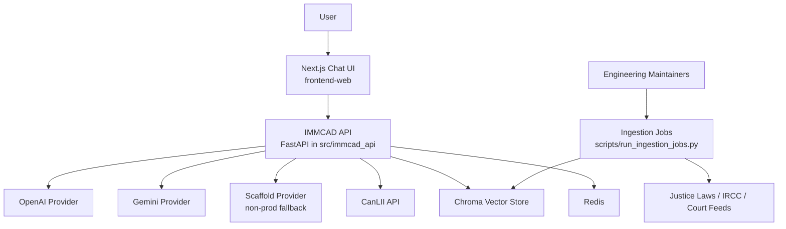

# 01. System Context

## Table of Contents

- [Purpose](#purpose)
- [Stakeholders and Personas](#stakeholders-and-personas)
- [System Boundary](#system-boundary)
- [External Systems and Dependencies](#external-systems-and-dependencies)
- [C4 Context Diagram](#c4-context-diagram)
- [Architectural Pattern](#architectural-pattern)

## Purpose

IMMCAD is an AI-powered legal information assistant for Canadian immigration topics. The system returns informational answers with policy-constrained behavior and citation grounding.

## Stakeholders and Personas

- End users: newcomers, students, workers, families.
- Legal professionals: RCICs/lawyers validating informational outputs.
- Engineering maintainers: backend, frontend, ingestion, and platform maintainers.
- Compliance and legal reviewers: policy, privacy, and release-approval owners.

## System Boundary

In scope:

- Chat experience and case search APIs.
- Policy-gated retrieval/response orchestration.
- Source registry validation, ingestion jobs, and legal corpus refresh.
- Operational telemetry and release evidence artifacts.

Out of scope:

- Legal representation or legal advice.
- Filing workflows and direct integration with privileged government systems.

## External Systems and Dependencies

- LLM providers:
  - OpenAI (primary when enabled).
  - Gemini (ordered fallback).
  - Scaffold provider (non-production/dev safety fallback).
- Legal/corpus sources:
  - CanLII API (case search metadata + citator).
  - Justice Laws and IRCC public sources.
  - SCC/FC/FCA court feeds.
- Data/runtime infrastructure:
  - Chroma vector store.
  - Redis cache/rate-limiting backend.

## C4 Context Diagram

## Architectural Pattern

- Production path: Next.js frontend + modular FastAPI backend.
- Runtime strategy: provider abstraction with ordered fallback and circuit-breaker telemetry.
- Governance strategy: policy-as-code gates for ingestion, response safety, and source governance.
- Legacy path: `app.py` Streamlit thin client retained for dev troubleshooting only.
