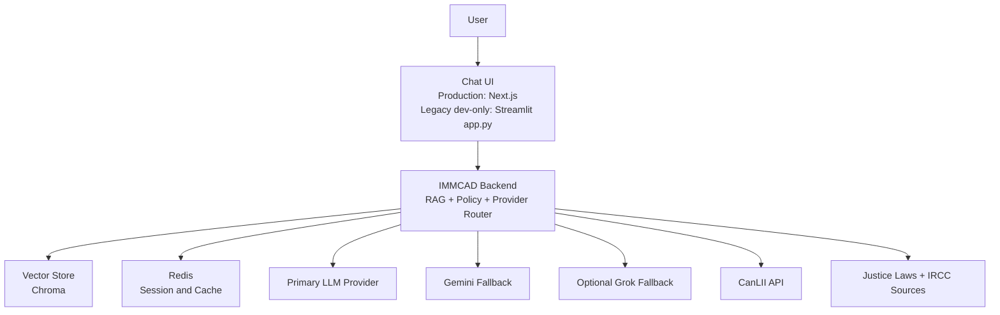

# 01. System Context

## Table of Contents

- [Table of Contents](#table-of-contents)
- [Purpose](#purpose)
- [Stakeholders and Personas](#stakeholders-and-personas)
- [System Boundary](#system-boundary)
- [External Systems](#external-systems)
- [C4 Context Diagram](#c4-context-diagram)
- [Architectural Pattern](#architectural-pattern)

- [Purpose](#purpose)
- [Stakeholders and Personas](#stakeholders-and-personas)
- [System Boundary](#system-boundary)
- [External Systems](#external-systems)
- [C4 Context Diagram](#c4-context-diagram)
- [Architectural Pattern](#architectural-pattern)

## Purpose

IMMCAD is an AI-powered legal information assistant being adapted to Canadian immigration law. It provides contextual answers with citations and legal disclaimers.

## Stakeholders and Personas

- End users: newcomers, students, workers, families seeking immigration guidance.
- Legal professionals: RCIC/lawyers reviewing informational outputs.
- Maintainers: engineers operating ingestion, retrieval, and model orchestration.
- Compliance owners: privacy and legal reviewers.

## System Boundary

In scope:

- User chat experience.
- Legal source ingestion, indexing, retrieval, and answer generation.
- Citation rendering and policy-safe refusal behavior.

Out of scope:

- Legal representation, legal advice, or case filing workflows.
- Government record systems integration requiring privileged access.

## External Systems

- OpenAI-compatible model APIs (primary agent runtime pattern).
- Gemini API (fallback provider).
- Optional Grok provider for future fallback.
- CanLII API for case-law metadata and citator relationships.
- Justice Laws Website and IRCC public resources for source ingestion.

## C4 Context Diagram

## Architectural Pattern

- Production: Next.js frontend plus modular monolith backend with clean module boundaries and provider abstraction.
- Legacy dev-only: single-process Streamlit script architecture retained in `app.py`.
