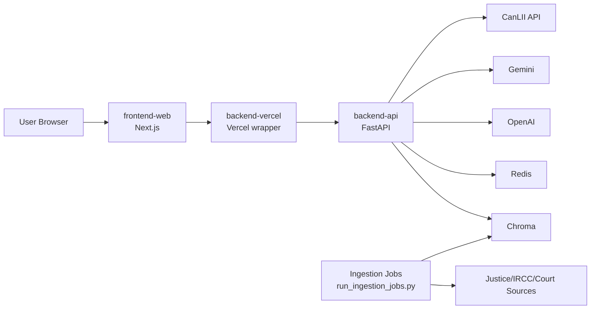

# 02. Container and Service Architecture

## Table of Contents

- [Execution Topologies](#execution-topologies)
- [Production Container View](#production-container-view)
- [Local Development View](#local-development-view)
- [Ingestion and Background Jobs](#ingestion-and-background-jobs)
- [C4 Container Diagram](#c4-container-diagram)
- [Service Boundaries and API Contracts](#service-boundaries-and-api-contracts)
- [Communication Patterns](#communication-patterns)
- [Deployment Notes](#deployment-notes)

## Execution Topologies

IMMCAD currently supports two practical execution modes:

1. Production-oriented runtime: Next.js frontend + Python API service.
2. Local developer runtime: same API + frontend, with optional legacy Streamlit thin client for troubleshooting.

## Production Container View

1. `frontend-web` (Next.js)
- User-facing chat UI and case-search UX.
- Server-side proxy contract to backend API.

2. `backend-api` (FastAPI, `src/immcad_api`)
- `/api/chat`, `/api/search/cases`, `/ops/metrics`, `/healthz`.
- Request auth/rate limiting, policy checks, provider routing, telemetry.

3. Data dependencies
- `chroma` for vector storage.
- `redis` for rate-limiting/cache-related controls.

## Local Development View

- API: `make api-dev` (`uvicorn immcad_api.main:app`).
- Frontend: `make frontend-dev`.
- Legacy UI (`app.py`) is dev-only and forwards to backend API.

## Ingestion and Background Jobs

Ingestion is script-driven today, not a standalone deployed container:

- `scripts/run_ingestion_jobs.py` executes cadence-based source ingestion.
- `scripts/run_ingestion_smoke.py` provides deterministic smoke validation.
- Checkpoint/state artifacts are persisted under `artifacts/ingestion/`.

This boundary remains extraction-ready if ingestion later becomes an independent worker service.

## C4 Container Diagram

## Service Boundaries and API Contracts

- Chat API: `POST /api/chat`
- Case search API: `POST /api/search/cases`
- Operations metrics: `GET /ops/metrics`
- Health check: `GET /healthz`

Detailed payload/response contracts are documented in `api-contracts.md`.

## Communication Patterns

- Browser -> frontend-web -> backend-api: HTTPS JSON.
- Backend -> external providers/sources: HTTPS with timeout/retry controls.
- Backend -> Redis/Chroma: internal network connectivity.
- Ingestion jobs -> registry/policy/source endpoints: scheduled/triggered script execution.

Server-side proxy contract to backend API:
- The browser communicates with `frontend-web`, and `frontend-web` proxies server-side requests to `backend-api`; browser clients do not call `backend-api` directly.

## Deployment Notes

- Vercel wrapper (`backend-vercel`) boots the same FastAPI app code from `src/immcad_api`.
- API bearer token and hardened runtime flags are mandatory in `production/prod`.
- CI quality and release gates validate architecture docs, ingestion smoke, and legal/policy artifacts.
