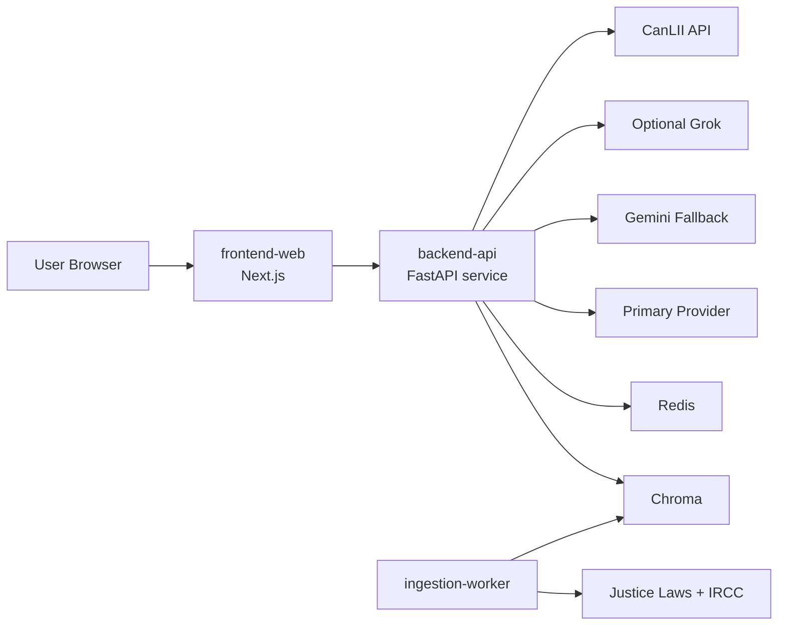

# 02. Container and Service Architecture

## Current Container View

- `app.py`: Streamlit UI + orchestration bootstrap.
- `lawglance_main.py`: conversation flow, retrieval invocation, cache usage.
- `chains.py`: history-aware retriever and RAG chain construction.
- `cache.py`: Redis cache and chat history adapter.
- Chroma local persistence in `chroma_db_legal_bot_part1/`.

## Target MVP Container View

1. `frontend-web` (Next.js + Tailwind)
- Minimal chat UI.
- Source chips/citation panel.
- Session lifecycle and UX-only concerns.

2. `backend-api` (Python)
- Chat API and orchestration.
- Retrieval, policy gates, provider routing, citation packaging.

3. `ingestion-worker` (Python jobs)
- Source ingestion and normalization.
- Incremental refresh and re-index scheduling.

4. Data services
- `vector-store` (Chroma for MVP, swappable later).
- `redis` for session and response cache.
- Optional SQL metadata store (future milestone).

## C4 Container Diagram

## Service Boundaries and API Contracts

- Public application API is documented in `api-contracts.md`.
- CanLII access is encapsulated behind backend adapter, never directly from browser.
- Provider SDK-specific logic stays inside `providers/` module.

## Communication Patterns

- UI to backend: HTTPS JSON.
- Backend to providers and CanLII: HTTPS with retries and timeouts.
- Backend to Redis/Chroma: local network connection.

## Deployment Notes

- MVP can run as one backend process + one frontend process + Redis.
- Migration-friendly boundaries allow extraction of ingestion worker and API service later.
