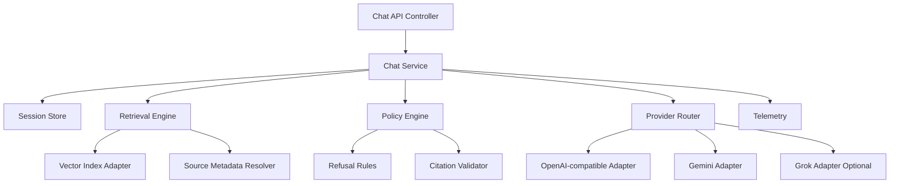

# 03. Component and Module Architecture

## Table of Contents

- [Table of Contents](#table-of-contents)
- [Backend Module Map (Target)](#backend-module-map-(target))
- [Current-to-Target Mapping](#current-to-target-mapping)
- [Component Diagram](#component-diagram)
- [Design Patterns](#design-patterns)
- [Architectural Constraints](#architectural-constraints)

- [Backend Module Map (Target)](#backend-module-map-(target))
- [Current-to-Target Mapping](#current-to-target-mapping)
- [Component Diagram](#component-diagram)
- [Design Patterns](#design-patterns)
- [Architectural Constraints](#architectural-constraints)

## Backend Module Map (Target)

- `api/`: HTTP endpoints, request/response schemas, auth middleware.
- `orchestration/`: chat flow, session handling, retry/fallback policies.
- `retrieval/`: query rewrite, source filtering, vector retrieval.
- `providers/`: OpenAI-compatible, Gemini, optional Grok adapters.
- `policy/`: compliance checks, refusal logic, citation-required rules.
- `sources/`: CanLII and official source connectors.
- `telemetry/`: tracing, metrics, structured logs.

## Current-to-Target Mapping

- `lawglance_main.py` maps to `orchestration/`.
- `chains.py` maps to `retrieval/`.
- `cache.py` maps to `orchestration/session_store.py`.
- `prompts.py` maps to `policy/prompts/` with domain/version tagging.

## Component Diagram

## Design Patterns

- Modular monolith with explicit module interfaces.
- Strategy pattern for provider selection and fallback.
- Policy-as-code for compliance enforcement.
- Adapter pattern for external APIs and storage backends.

## Architectural Constraints

- No provider SDK calls from controller layer.
- No response returned unless citation validator passes.
- Fallback events must emit structured telemetry.
