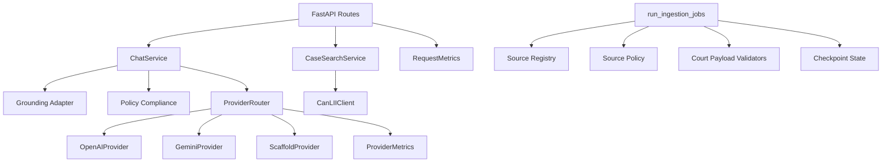

# 03. Component and Module Architecture

## Table of Contents

- [Backend Module Map (Current)](#backend-module-map-current)
- [Primary Request Flow](#primary-request-flow)
- [Component Diagram](#component-diagram)
- [Design Patterns](#design-patterns)
- [Architectural Constraints](#architectural-constraints)

## Backend Module Map (Current)

- `api/`
  - Route builders and HTTP boundary (`routes/chat.py`, `routes/cases.py`).
- `services/`
  - Application services (`ChatService`, `CaseSearchService`, grounding adapters).
- `providers/`
  - Provider adapters and `ProviderRouter` with circuit breaker + telemetry.
- `policy/`
  - Compliance logic, citation/refusal controls, source policy decisions.
- `sources/`
  - CanLII client, source registry model, court feed parsers/validation.
- `ingestion/`
  - Cadence planner, ingestion job orchestration, checkpoint/state handling.
- `middleware/`
  - Runtime rate-limit backend selection and enforcement.
- `telemetry/`
  - Request/provider metrics and trace-id utilities.
- `ops/`
  - Ops alert evaluation logic and thresholds integration.

## Primary Request Flow

1. Request enters FastAPI app and trace middleware.
2. Bearer auth and API rate-limiting gates are evaluated.
3. Router dispatches to chat or case-search service.
4. Chat path:
  - grounding candidates assembled,
  - provider routing executed with fallback policy,
  - citation/refusal policy enforcement applied,
  - structured telemetry emitted.
5. Response returns with `x-trace-id`.

## Component Diagram

## Design Patterns

- Modular monolith with explicit package boundaries.
- Adapter pattern for external providers and source systems.
- Policy-as-code for runtime safety and legal/compliance controls.
- Strategy pattern for provider ordering/fallback.
- Scriptable operational workflows for ingestion and release validation.

## Architectural Constraints

- Route layer must not call provider SDKs directly.
- Hardened environments (`production/prod`) require explicit bearer token and trusted citation domains.
- Chat responses are policy-constrained and citation-validated before delivery.
- Source ingestion is policy-gated by environment and source ID.
- Architecture-affecting changes require matching updates to docs and ADRs.
