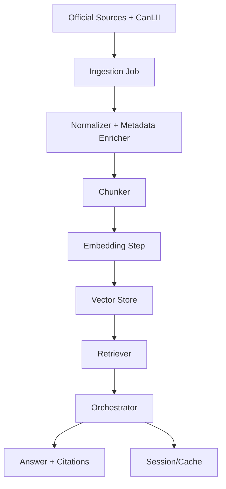

# 04. Data Architecture

## Table of Contents

- [Table of Contents](#table-of-contents)
- [Data Domains](#data-domains)
- [Canonical Metadata Schema](#canonical-metadata-schema)
- [Data Flow](#data-flow)
- [Governance and Lifecycle](#governance-and-lifecycle)
- [Risks and Controls](#risks-and-controls)

- [Data Domains](#data-domains)
- [Canonical Metadata Schema](#canonical-metadata-schema)
- [Data Flow](#data-flow)
- [Governance and Lifecycle](#governance-and-lifecycle)
- [Risks and Controls](#risks-and-controls)

## Data Domains

1. Legal source corpus
- Statutes/regulations/policies with source metadata and effective dates.

2. Retrieval artifacts
- Chunked documents, embeddings, vector index state.

3. Runtime state
- Session history and answer cache in Redis.

4. Observability events
- Request logs, provider routing/fallback events, guardrail outcomes.

## Canonical Metadata Schema

```json
{
  "$schema": "https://json-schema.org/draft/2020-12/schema",
  "title": "LegalSourceMetadata",
  "type": "object",
  "required": ["source_id", "jurisdiction", "source_type"],
  "properties": {
    "source_id": {
      "type": "string",
      "minLength": 3,
      "maxLength": 128
    },
    "jurisdiction": {
      "type": "string",
      "pattern": "^[A-Za-z]{2}$",
      "description": "ISO 3166-1 alpha-2 code"
    },
    "source_type": {
      "type": "string",
      "enum": ["statute", "regulation", "policy", "case_law"]
    },
    "instrument": {
      "type": "string",
      "maxLength": 160
    },
    "section": {
      "type": "string",
      "maxLength": 80
    },
    "effective_date": {
      "type": "string",
      "format": "date"
    },
    "published_date": {
      "type": "string",
      "format": "date"
    },
    "url": {
      "type": "string",
      "format": "uri"
    },
    "checksum": {
      "type": "string",
      "pattern": "^[A-Fa-f0-9]{64}$",
      "description": "SHA-256 hex digest"
    },
    "version": {
      "type": "string",
      "maxLength": 64
    }
  },
  "additionalProperties": false
}
```

Notes:
- Dates use `YYYY-MM-DD`.
- `checksum` uses SHA-256 of normalized source content.

## Data Flow



## Governance and Lifecycle

- Freshness targets:
  - Statutes/regulations: weekly re-check.
  - Dynamic policy pages: daily re-check.
  - CanLII metadata: scheduled incremental sync.
- Deduplication: URL + checksum + version fields.
- Data retention: session TTL in Redis; archival strategy for logs.

## Risks and Controls

- Drift risk: stale policy content.
- Control: freshness jobs + metadata timestamp checks.
- Hallucination risk: weak grounding.
- Control: citation-required response policy.
