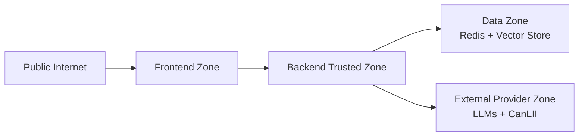

# 05. Security and Compliance Architecture

## Table of Contents

- [Security Objectives](#security-objectives)
- [Trust Zones](#trust-zones)
- [Authentication and Authorization (MVP)](#authentication-and-authorization-(mvp))
- [Compliance Controls](#compliance-controls)
- [Threat Model Highlights](#threat-model-highlights)
- [Mitigations](#mitigations)
- [Incident Response](#incident-response)

## Security Objectives

- Protect user data in transit and at rest.
- Prevent unauthorized access to provider keys and API endpoints.
- Ensure policy-compliant, non-advisory legal responses.

## Trust Zones

## Authentication and Authorization (MVP)

- API key or session token for frontend-to-backend requests.
- Service-level secrets only on backend.
- Role-based internal separation for ingestion vs runtime APIs.

## Compliance Controls

- Legal disclaimer displayed with every response path.
- Refusal templates for legal-advice, out-of-scope, or unsupported content.
- Citation requirement gate for legal factual claims.
- PIPEDA-oriented controls:
  - Data minimization for logs.
  - Defined retention windows.
  - Access controls for stored conversation data.
- CanLII terms constraints:
  - Bounded query limits.
  - No bulk/systematic downloading behavior.

## Threat Model Highlights

- Prompt injection via user input.
- Source poisoning from ingestion channels.
- Secret leakage via logs.
- Provider outage and degraded behavior.

## Mitigations

- Input normalization and policy checks.
- Strong input validation with explicit length limits and character allowlists.
- Source allowlist and signed ingestion manifests.
- Secret redaction in logs and traces.
- Rate limiting with API throttling and DDoS protection controls.
- Encryption controls: TLS 1.3 in transit and AES-256 at rest.
- Immutable, tamper-evident audit logging for security-relevant events.
- Fallback routing with bounded retries and circuit breaker behavior.

## Incident Response

- Severity matrix for model/provider failures and data incidents.
- Trace ID-centric investigation workflow.
- Key rotation runbook and emergency provider disable switch.
