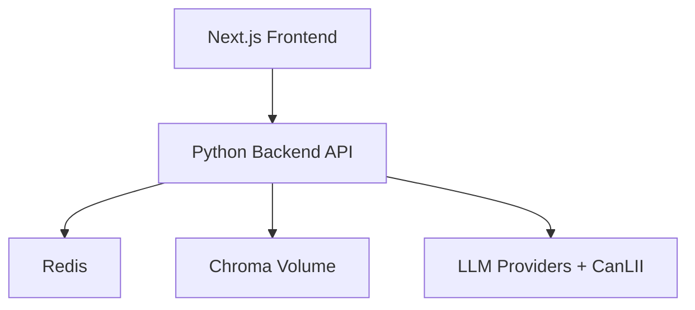

# 07. Deployment and Operations Architecture

## Table of Contents

- [Table of Contents](#table-of-contents)
- [Environments](#environments)
- [Deployment Topology (MVP)](#deployment-topology-(mvp))
- [Operational Responsibilities](#operational-responsibilities)
- [Runtime Controls](#runtime-controls)
- [Monitoring and Alerting](#monitoring-and-alerting)
- [Backup and Recovery](#backup-and-recovery)

- [Environments](#environments)
- [Deployment Topology (MVP)](#deployment-topology-(mvp))
- [Operational Responsibilities](#operational-responsibilities)
- [Runtime Controls](#runtime-controls)
- [Monitoring and Alerting](#monitoring-and-alerting)
- [Backup and Recovery](#backup-and-recovery)

## Environments

- Local development: single machine, uv-managed Python runtime, optional Redis container.
- Staging: production-like configuration with non-production keys.
- Production: isolated secrets, HTTPS-only ingress, controlled rollout.

## Deployment Topology (MVP)

## Operational Responsibilities

- Frontend deployment pipeline and smoke checks.
- Backend deployment with health checks and dependency checks.
- Ingestion scheduling and freshness monitoring.

## Runtime Controls

- Health endpoints for API and dependency status.
- Readiness should fail when required dependencies are unavailable.
- Feature flags for provider routing and fallback behavior.

## Monitoring and Alerting

- Operational metrics endpoint: `GET /ops/metrics`.
- Alert thresholds (actionable baseline):
  - Error rate: `request_metrics.errors.rate > 0.05` for 10 minutes.
  - Fallback rate: `request_metrics.fallback.rate > 0.20` for 10 minutes.
  - Refusal rate: `request_metrics.refusal.rate > 0.35` for 15 minutes.
  - Latency: `request_metrics.latency_ms.p95 > 8000` for 10 minutes.
- Alert automation:
  - Threshold source of truth: `config/ops_alert_thresholds.json`
  - Scheduled evaluator workflow: `.github/workflows/ops-alerts.yml`
  - Local evaluator command: `make ops-alert-eval`
- Required runbook links:
  - Incident observability triage: `docs/release/incident-observability-runbook.md`
  - Staging smoke rollback triggers: `docs/release/staging-smoke-rollback-criteria.md`
  - Backup/recovery operational targets: `docs/release/backup-and-recovery-operational-targets.md`
  - Ingestion checkpoint recovery: `docs/release/ingestion-checkpoint-recovery.md`
  - Legal release sign-off checklist: `docs/release/legal-review-checklist.md`
- Alerts on ingestion freshness breaches.
- Alerts on policy failure/citation validator regressions.

## Backup and Recovery

- Authoritative operational targets and checklist:
  - `docs/release/backup-and-recovery-operational-targets.md`
- Baseline targets:
  - Incremental backup cadence: hourly.
  - Full backup cadence: daily (`02:00 UTC` for vector store, `02:15 UTC` for ingestion artifacts).
  - Retention: 7-day hourly, 90-day daily, 365-day monthly compliance snapshots.
  - RTO: 4 hours.
  - RPO: 60 minutes.
  - Drill cadence: quarterly tabletop, annual full failover simulation.
