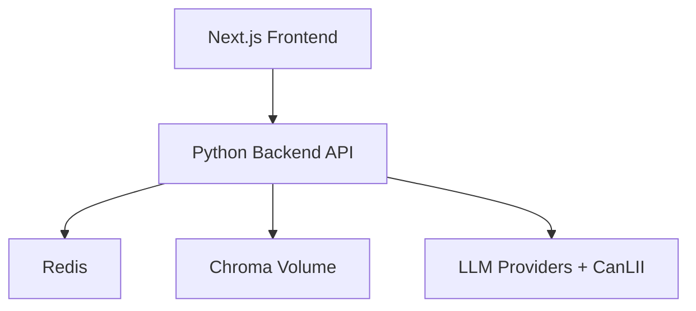

# 07. Deployment and Operations Architecture

## Environments

- Local development: single machine, uv-managed Python runtime, optional Redis container.
- Staging: production-like configuration with non-production keys.
- Production: isolated secrets, HTTPS-only ingress, controlled rollout.

## Deployment Topology (MVP)

## Operational Responsibilities

- Frontend deployment pipeline and smoke checks.
- Backend deployment with health checks and dependency checks.
- Ingestion scheduling and freshness monitoring.

## Runtime Controls

- Health endpoints for API and dependency status.
- Readiness should fail when required dependencies are unavailable.
- Feature flags for provider routing and fallback behavior.

## Monitoring and Alerting

- Alerts on elevated latency, error spikes, fallback saturation.
- Alerts on ingestion freshness breaches.
- Alerts on policy failure/citation validator regressions.

## Backup and Recovery

- Backup schedule for vector persistence directory:
  - Incremental snapshot every hour.
  - Full backup daily at 02:00 UTC.
  - Weekly integrity check and restore test of latest full + incrementals.
- Retention and pruning policy:
  - Hourly snapshots retained for 7 days.
  - Daily full backups retained for 90 days.
  - Monthly compliance snapshot retained for 365 days.
  - Automated pruning deletes expired snapshots after checksum verification.
- Recovery objectives:
  - RTO: 4 hours for chat API service recovery.
  - RPO: 60 minutes for vector-store and metadata recovery.
- Disaster recovery playbook:
  - Incident commander (on-call SRE) declares DR event and starts runbook.
  - Restore Redis and vector backups in order, then replay ingestion metadata deltas.
  - Verify checksums, run smoke tests (`/healthz`, sample chat flow, case search call), then reopen traffic.
  - Failover order: DNS/API ingress cutover -> backend API -> Redis -> vector store.
  - Roles: SRE owns failover execution, backend lead validates app integrity, legal/compliance lead approves data handling.
- Drill cadence:
  - Tabletop DR exercise quarterly.
  - Full failover simulation annually with postmortem and runbook updates.
