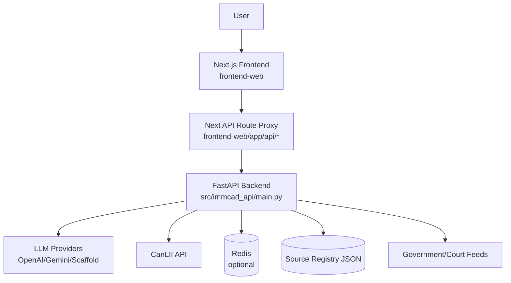
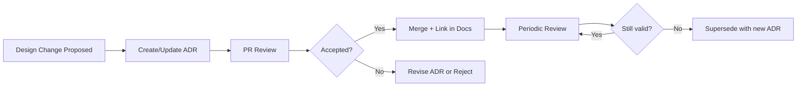

# 10. Architecture Analysis and Governance

## Table of Contents

- [Table of Contents](#table-of-contents)
- [Purpose](#purpose)
- [Current Architecture Snapshot (Evidence-Based)](#current-architecture-snapshot-evidence-based)
- [Architecture Framework and Tooling Choices](#architecture-framework-and-tooling-choices)
- [Data Flow and Communication Patterns](#data-flow-and-communication-patterns)
- [Security, Reliability, and Cross-Cutting Observations](#security-reliability-and-cross-cutting-observations)
- [Architecture Debt and Improvement Opportunities](#architecture-debt-and-improvement-opportunities)
- [ADR Program and Governance Process](#adr-program-and-governance-process)
- [Documentation Automation and Maintenance Workflow](#documentation-automation-and-maintenance-workflow)
- [Recommended Next Iteration Backlog](#recommended-next-iteration-backlog)

## Purpose

This document synthesizes the existing architecture corpus in `docs/architecture/` into a single
evidence-based operational view. It is intended as the entrypoint for maintainers who need to:

- understand how the system works today from code, not just target-state diagrams;
- see how C4 + arc42 + ADR + automation practices fit together in this repository; and
- plan architecture-documentation maintenance as the codebase evolves.

Use this file together with:

- `01-system-context.md` through `09-documentation-automation.md` for detailed topic-specific views;
- `arc42-overview.md` for the narrative architecture template; and
- `adr/` for design decision traceability.

## Current Architecture Snapshot (Evidence-Based)

### Runtime Topology (Current)

- **Primary frontend container**: Next.js 14 application in `frontend-web/` (`frontend-web/package.json`).
- **Primary backend container**: FastAPI app in `src/immcad_api/main.py`, exported as `app = create_app()`.
- **Serverless adapter path**: Vercel Python entrypoint shim in `backend-vercel/api/index.py` imports the same backend app.
- **Legacy development UI**: Streamlit app in `app.py`, explicitly marked as legacy/troubleshooting-only.

### Backend Composition

`src/immcad_api/main.py` assembles the application root and wires:

- settings loading (`immcad_api.settings.load_settings`)
- provider instances + `ProviderRouter` with circuit-breaker behavior
- `ChatService` with policy gating and citation enforcement
- `CaseSearchService` backed by `CanLIIClient`
- request tracing, API bearer token enforcement, and rate limiting middleware
- `/healthz` and `/ops/metrics` operational endpoints

The route layer is split by domain:

- `src/immcad_api/api/routes/chat.py` -> `POST /api/chat`
- `src/immcad_api/api/routes/cases.py` -> `POST /api/search/cases`

### Frontend Composition

`frontend-web/app/page.tsx` renders `ChatShell` and reads runtime config via
`frontend-web/lib/runtime-config.ts`. The browser-facing API calls are proxied through Next.js route
handlers (for example `frontend-web/app/api/chat/route.ts`) to the backend using
`frontend-web/lib/backend-proxy.ts`.

This proxy layer also contains a **development-only scaffold fallback** path when backend config is
missing or unreachable, which is useful for preview environments but should remain tightly
controlled.

### Ingestion and Source Validation Pipeline

Ingestion is registry-driven:

- `src/immcad_api/sources/source_registry.py` defines the canonical registry schema and loader.
- `src/immcad_api/ingestion/planner.py` maps registry sources into cadence buckets.
- `src/immcad_api/ingestion/jobs.py` executes fetches, maintains checkpoints, and emits per-source reports.
- `scripts/run_ingestion_jobs.py` is the CLI wrapper that persists JSON reports and checkpoints.

Court feeds now have payload-specific validation hooks via `src/immcad_api/sources/canada_courts.py`,
and `src/immcad_api/ingestion/jobs.py` can enforce configurable invalid-ratio and year-window rules.

## Architecture Framework and Tooling Choices

The repository already follows a strong documentation-as-code model. The chosen framework is:

- **C4 model** for context/container/component views:
  - `01-system-context.md`
  - `02-container-and-service-architecture.md`
  - `03-component-and-module-architecture.md`
- **arc42 narrative coverage** for constraints, strategy, runtime, quality, risks:
  - `arc42-overview.md`
  - topic docs `04` through `09`
- **ADRs** for decision traceability:
  - `docs/architecture/adr/ADR-000-template.md`
  - accepted ADRs in `docs/architecture/adr/ADR-001...`
- **Mermaid diagram-as-code** for maintainable diagrams:
  - diagrams embedded in architecture docs
  - generated module dependency graph in `docs/architecture/diagrams/generated-module-dependencies.mmd`
- **Automation/validation**:
  - `scripts/generate_module_dependency_diagram.py`
  - `scripts/validate_architecture_docs.sh`
  - `.github/workflows/architecture-docs.yml`

### Why this combination fits IMMCAD

- It supports both **current-state operations** and **target-state migration planning** (important
  because the repo still carries legacy Streamlit/LawGlance artifacts).
- It remains lightweight enough for a small team (Markdown + Mermaid + shell validation) while still
  giving strong structure.
- It preserves traceability through ADRs without introducing heavy centralized tooling.

### Tooling alternatives (for future adoption)

- **Structurizr**: good fit if C4 diagrams need richer consistency checks or stakeholder publishing.
- **PlantUML**: useful if sequence/deployment diagrams become more complex than Mermaid supports.
- **OpenAPI generation**: recommended for API contract drift control (see backlog below).

## Data Flow and Communication Patterns

### 1. Chat Request Path (User -> Answer)

1. Browser UI renders `ChatShell` in `frontend-web/app/page.tsx`.
2. Frontend sends request through Next.js route proxy (`frontend-web/app/api/chat/route.ts`).
3. Proxy forwards to backend via `frontend-web/lib/backend-proxy.ts`.
4. FastAPI request middleware in `src/immcad_api/main.py` attaches trace ID and enforces auth/rate limits.
5. `ChatService` in `src/immcad_api/services/chat_service.py` applies policy gates and citation enforcement.
6. `ProviderRouter` in `src/immcad_api/providers/router.py` selects/falls back across providers.
7. Response returns with `x-trace-id` propagated back to the client.

### 2. Case Search Path (User -> CanLII Results)

1. Frontend calls backend (directly or via proxy route).
2. `POST /api/search/cases` route delegates to `CaseSearchService`.
3. `CaseSearchService` calls `CanLIIClient.search_cases`.
4. `CanLIIClient` enforces usage limits and fetches metadata from CanLII (`httpx`).
5. Results are normalized into `CaseSearchResponse` Pydantic models.
6. On failure, a scaffold fallback may be returned depending on environment/config.

### 3. Scheduled Ingestion Path (Registry -> Report + Checkpoints)

1. Scheduler/CI invokes `scripts/run_ingestion_jobs.py`.
2. CLI calls `run_ingestion_jobs(...)` in `src/immcad_api/ingestion/jobs.py`.
3. Registry is loaded and grouped by cadence via `ingestion/planner.py`.
4. Fetch loop executes conditional HTTP requests using saved checkpoints.
5. Court-source payloads are parsed/validated (`canada_courts.py`) and may fail on threshold breaches.
6. JSON execution report + updated checkpoints are written to `artifacts/ingestion/`.

## Security, Reliability, and Cross-Cutting Observations

### Security Controls Present in Code

- **API bearer token enforcement** in `src/immcad_api/main.py` for `/api/*` requests (environment-gated).
- **Request rate limiting** with Redis-backed and in-memory fallback implementations in
  `src/immcad_api/middleware/rate_limit.py`.
- **Policy refusal and citation enforcement** in `src/immcad_api/policy/compliance.py` and
  `src/immcad_api/services/chat_service.py`.
- **Runtime configuration validation** in `src/immcad_api/settings.py`, including production safety
  checks for scaffold citations and missing bearer token.

### Reliability and Operability Controls Present in Code

- **Provider fallback routing** and **circuit-breaker behavior** in `src/immcad_api/providers/router.py`.
- **Operational metrics endpoint** (`/ops/metrics`) in `src/immcad_api/main.py`.
- **Checkpoint-based ingestion** with ETag/Last-Modified support in `src/immcad_api/ingestion/jobs.py`.
- **CI workflows** for quality/release/staging smoke/ingestion jobs in `.github/workflows/`.

## Architecture Debt and Improvement Opportunities

This section complements `08-architecture-debt-and-improvement-plan.md` with code-level observations.

### High-Value Improvements

1. **Formalize API contract generation**
- Current contracts are documented in `docs/architecture/api-contracts.md`, but no generated OpenAPI
  snapshot is committed.
- Recommendation: add an automated OpenAPI export step and contract-drift check in CI.

2. **Consolidate legacy/production boundary**
- `app.py` and legacy LawGlance modules remain in the repo and can confuse onboarding.
- Recommendation: continue moving legacy files under `legacy/` and tighten import boundaries in CI.

3. **Strengthen documentation consistency linting**
- Architecture docs and ADR template/index currently contain duplicated TOC bullets (fixed in this pass
  for key index files/template, but this pattern may recur).
- Recommendation: add a markdown lint rule or script check for duplicate TOC entries.

4. **Promote deployment topology docs into environment-specific runbooks**
- `07-deployment-and-operations.md` is strong, but deploy-time configuration drift across Vercel/API/CI
  would benefit from a single environment matrix sourced from actual env examples and workflow inputs.

## ADR Program and Governance Process

### Current State

- ADR template exists: `docs/architecture/adr/ADR-000-template.md`
- Accepted ADRs exist for modular backend, Next.js UI, provider fallback, citation gate, and observability.
- ADRs are already referenced by the architecture README and validation script (via ADR count threshold).

### Governance Rules (Recommended and Applied)

Create or update an ADR when a change affects:

- system boundaries or service ownership,
- API contracts or error envelopes,
- provider routing/fallback semantics,
- source validation gates or legal-compliance controls,
- deployment/observability/security posture.

Review cadence:

- **Per PR**: architecture-impacting changes require ADR reference or explicit “no ADR needed” note.
- **Quarterly**: review accepted ADRs for supersession candidates.
- **Major release**: reconcile ADRs with `08-architecture-debt-and-improvement-plan.md`.

### ADR Lifecycle (Suggested)

## Documentation Automation and Maintenance Workflow

### Existing Automation

- `scripts/generate_module_dependency_diagram.py` generates Mermaid dependency diagrams from Python imports.
- `scripts/validate_architecture_docs.sh` validates required files, ADR count, Mermaid presence, and generated diagram.
- `.github/workflows/architecture-docs.yml` runs both generation and validation on PRs and pushes to `main`.

### Maintainer Workflow

1. Update architecture docs/ADRs in the same PR as the code change.
2. Regenerate dependency diagram (if Python module boundaries changed).
3. Run `bash scripts/validate_architecture_docs.sh`.
4. Review cross-links and ADR references before merge.

## Recommended Next Iteration Backlog

1. Add OpenAPI export + CI drift validation for `src/immcad_api` routes.
2. Add markdown lint checks for duplicate TOC and broken local links in `docs/architecture/`.
3. Publish rendered architecture docs as CI artifacts (or GitHub Pages preview) for reviewer consumption.
4. Evaluate Structurizr Lite for C4 model source-of-truth if diagram count/complexity increases.
5. Add a machine-readable architecture inventory (JSON/YAML) for services, endpoints, datastores, and owners.

